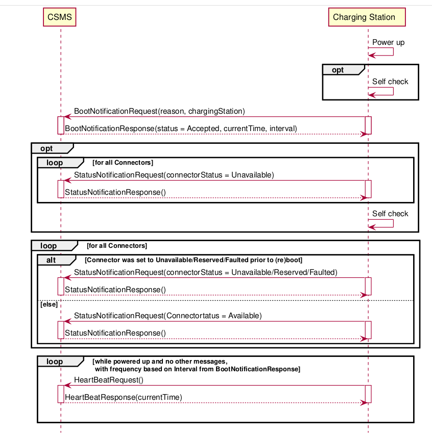
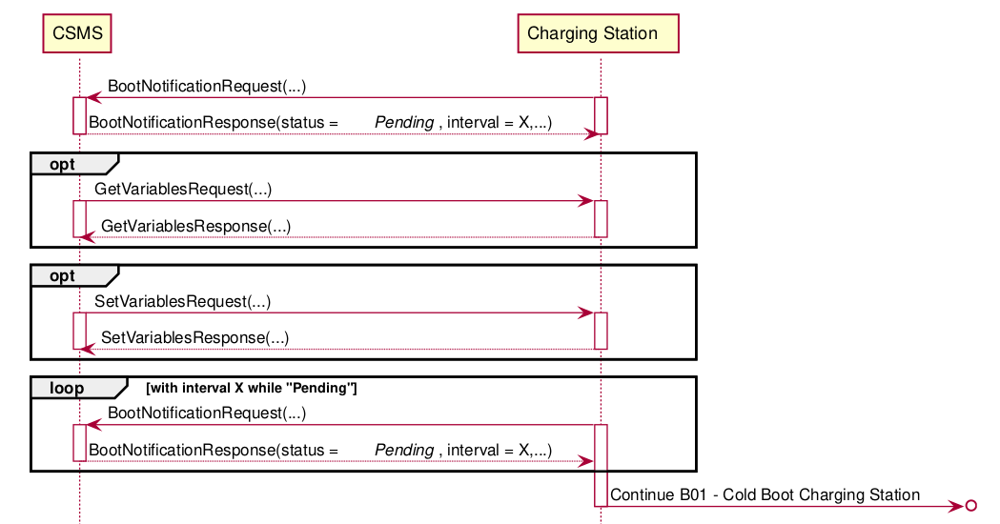
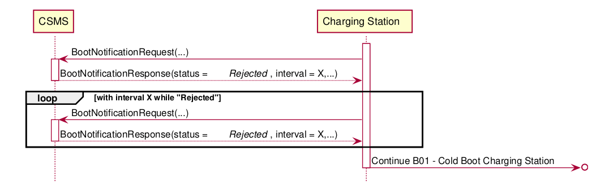

# Test_Job

Данное приложение является клиентом, развернутым на зарядной станции, с целью коммуникации с CSMS
сервером, управляющим пулом из станций.
В рамках тестового задания предлагается реализовать логику Cold Boot Charging Station (полное
описание представлено пунктами B01-B03 в файле
спецификации ```OCPP-2.0_part2_specification.pdf```).

Cold Boot Charging Station должен запускаться при старте приложения с помощью
класса ```StartupApplicationListener```. Логику следует реализовать в
методе ```BootService.bootUp()```.

Для коммуникации с CSMS сервером используйте интерфейс CsmsClient. Имплементировать его не нужно.

Предлагается реализовать 3 сценария представленные диаграммами

- Accepted
  
- Pending
  
- Rejected
  
  На всех диаграммах CSMS - сервер, Charging Station - реализуемый клиент.

DoD:

- **Должны выполняться тесты.** Сервис не должен запускаться, так как нет имплементации csms и can
  клиентов.
- При запуске метода ```BootService.bootUp()``` должна выполняться логика Cold Boot в соответствии с
  представленной спецификацией

Дополнительная информация:

- Предполагается, что сервер CSMS всегда доступен и отвечает корретно.
- Для получения статуса коннектора, для отправки StatusNotificationRequest, используйте интерфейс
  CanClient. Имплиментировать интерфейс не нужно.
- Запросы GetVariablesRequest и SetVariablesRequest приходят в rest контроллер - OccpController.

В качестве бонусного задания предлагается реализовать сохранение переменных получаемых из
SetVariablesRequest в БД:

- Переменные получаемые из SetVariablesRequest должны сохраняться в бд, чтобы они могли
  переиспользоваться при рестарте приложения
- Переменные возвращаемые в GetVariablesConfirmation должны извлекаться из бд
- Для создание таблиц бд предлагается использовать liquibase. Но и другие альтернативы возможны